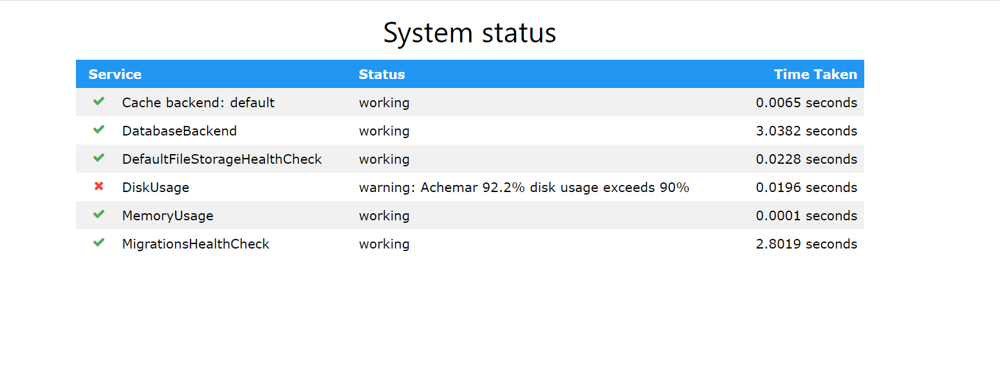

= Movie API admin endpoints

Documentation version *{page-component-version}* of Movie API

= /health

=== Supported Methods
    GET

=== Field data type
    None

=== Retrieve list of movies

    Method:GET
    Authentication : None

Sample Response: 

= /api/version/

=== Supported Methods
    GET

=== Field data type
    None

=== Retrieve list of movies

    Method:GET
    Authentication : None

Sample Response: 

[source]
----
{
    "version": 1
}
----
